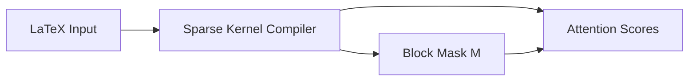

# SciMD — Scientific Markdown for the AI Era

> **An open document format designed for humans to write, machines to understand, and science to advance.**

[](LICENSE)
[](SPECIFICATION.md)
[](https://doi.org/10.5281/zenodo.19080882)

---

## The Problem: Science papers are still focused on print-era formats

The four dominant formats for scientific literature were all designed for *human readers on paper*, not for machines. Each carries a different set of costs when fed to AI systems.

### PDF
PDF is a page-layout format. in order to use it with LLMs we need to convert it to markdown. When feeding it to an LLM, it will be processed with an OCR as images, not as plain text, so info extraction will rely on the OCR quality. This leads to:

- **Broken corpus**: pdf document layout may not be completely lineal, so when the OCR reads the document, it may have sections and text mixed on the output
- **Equations are not parsed**: inline equiations are read as plain text or not processed at all, so they can be lost or very confusing for both humans and machines
- **Figures are not parsed**: figures are read as images so OCRs can't parse them to text, they are lost on the output file so the model can't use them. This is a big problem for scientific papers where figures are very important for the context.
- **Charts will have no data**: just the image, so the model can't use them to extract data or understand the context.
- **Merged bibliography entries**: multi-column layouts fuse references into nonsense strings
- **Zero structure**: the document is a flat stream of positioned text fragments; sections, abstracts, and captions are indistinguishable

PDF-extracted Markdown scores **4.2/10** in LLM comprehension benchmarks and carries a **High hallucination risk** — models fill the gaps with confabulation.

### XML / JATS

JATS (Journal Article Tag Suite) is the publishing industry standard. It has full metadata, structured sections, and complete bibliographies — but:

- **72% of its bytes are markup**: not content. A single paper exceeds 32,000 tokens, overflowing standard 8K context windows
- **Schema expertise required**: `<xref ref-type="bibr" rid="b12">` is not natural language
- **No author interpretation**: figures have captions, but no author-written analysis of what they mean
- **No dependency graph**: sections have IDs but no declared relationships between them
- **LLM training cost**: 6.5× more compute per sample than an equivalent parsed SciMD document

### HTML / LaTeXML

LaTeXML converts LaTeX to HTML. In theory it preserves structure; in practice:

- **MathML for equations**: formulas become dozens of nested XML tags instead of clean LaTeX
- **Tag density is too high**: `<mi>`, `<mo>`, `<mrow>` tags make up the majority of content; attention mechanisms dilute over markup
- **Blob structure**: sections run together without clean boundaries, making semantic chunking require XPath expertise
- **Not usable as training text** directly — requires complex preprocessing before a model can learn from it

### LaTeX Source

LaTeX source files are closer to SciMD than PDF, but:

- **Command noise** — `\begin{figure}`, `\vspace{-0.5em}`, `\hspace*{\fill}` are layout commands, not meaning
- **Figures still opaque** — `\includegraphics{fig1.pdf}` tells you nothing about the figure's content
- **No semantic section metadata** — `\section{Methods}` has a title but no type, summary, or dependency declaration
- **Compilation required** — figures, cross-references, and bibliographies only resolve after running `pdflatex`

---

## The Solution: Author-Time Structure

**SciMD** (`.smd`) resolves these problems at the source — when the author writes the document, not when a converter tries to reverse-engineer it later.

| Problem | Root cause | SciMD solution |
|---|---|---|
| Equations as images | PDF renders math as pixels | Native LaTeX: `$E = mc^2$`, `$$...$$` blocks |
| Figures without context | No standard for machine-readable descriptions | Mandatory `::description` + `::interpretation` per figure |
| Charts as opaque images | No data attached to visual | `::chart` block with tabular data + author interpretation |
| Arbitrary text chunks | No semantic boundaries | `::section{#id}` with `type`, `summary`, `depends_on` |
| Expensive XML processing | 72% markup overhead | Plain text — 0% markup, ~4K tokens per paper (parsed) |
| Hallucination from gaps | Missing context forces guessing | Every visual element carries the author's explanation |
| Poor RAG retrieval | No chunk-level metadata | Each section has `id`, `type`, `summary`, and dependency links |
| Inconsistent training data | PDF artifacts vary by converter | Deterministic structure defined at authoring time |

---

## How SciMD Works

A `.smd` file is valid UTF-8 plain text composed of three layers: a **document header**, **semantic sections**, and **rich elements** inside those sections.

### 1. YAML Frontmatter — Machine-Readable Document Metadata

Every SciMD file opens with a structured YAML header that captures everything a system needs to index, cite, or filter the document — without parsing prose:

```yaml
---smd
title: "Optimization of Transformer Attention via Sparse Kernels"
authors:
  - name: "Dr. Elena Rossi"
    orcid: "0000-0002-1825-0097"
    affiliation: "Neural Computing Lab, ETH Zurich"
    email: "erossi@ethz.ch"
    corresponding: true
version: "0.1.0"
lang: "en"
date: "2026-03-20"
license: "CC-BY-4.0"
keywords: ["Transformers", "Attention", "Sparsity", "LLM Optimization"]
abstract: |
  The quadratic complexity of standard self-attention remains a bottleneck
  for long-sequence LLMs. We propose a sparse kernel achieving 40% speedup
  at 32k tokens while preserving 98% perplexity on standard benchmarks.
citation:
  doi: "10.1234/sparse-attention-2026"
references:
  - id: "vaswani2017"
    type: "article"
    authors: ["Vaswani, A.", "Shazeer, N."]
    title: "Attention is All You Need"
    journal: "NeurIPS"
    year: 2017
---
```

Unlike a JATS XML header (hundreds of lines of tags) or a PDF title page (unparseable text), this header is directly queryable: filter by `keywords`, sort by `date`, resolve `doi`, expand `references` — zero preprocessing.

### 2. Semantic Sections — Chunking by Design

Content is organized into typed, labeled sections with explicit dependency declarations. This structure is **authored once** and reused by every downstream system — RAG pipelines, training corpora, search indexes:

```markdown
::section{#methods}
::meta
type: methods
summary: "Tiled sparse attention kernel using block-level sparsity on H100 GPUs."
depends_on: ["#introduction"]
::

# Methodology

Our approach divides the attention matrix into $64 \times 64$ blocks.
Only blocks within a Hamming distance of the diagonal are computed,
reducing the effective complexity from $O(n^2)$ to $O(n \log n)$.

::endsection
```

Each section provides a RAG retriever with `id`, `type`, `summary`, and `depends_on` without any post-processing. A query for "methods used in this paper" hits `#methods` directly and knows it depends on `#introduction`.

### 3. Rich Elements — Data and Meaning, Not Pixels

**Charts** — tabular data + mandatory author interpretation, not images:

```markdown
::chart{#tbl-latency}
::title Latency (ms) vs. sequence length on H100 GPUs
::interpretation
The sparse kernel underperforms at short sequences (4k–8k) due to
kernel launch overhead, but achieves 2.55× speedup at 64k tokens —
the regime where long-context LLMs actually operate.
::
| Sequence Length | Dense (ms) | Sparse (ms) | Speedup |
|---|---|---|---|
| 4,096  | 12.4   | 14.1   | 0.88× |
| 16,384 | 192.5  | 115.3  | 1.67× |
| 65,536 | 3520.1 | 1380.5 | 2.55× |
::endchart
```

**Equations** — LaTeX with semantic labels:

```markdown
::equation{#eq-sparse-attn}
$$
\text{Attention}(Q, K, V) = \text{softmax}\!\left(\frac{QK^\top \odot M}{\sqrt{d_k}}\right) V
$$
::label Sparse attention with block mask M
::endequation
```

**Figures** — two mandatory text blocks (description + interpretation):

```markdown
::figure{#fig-sparsity-pattern}
::file sparsity_pattern.png
::description
Heat map of a 512×512 attention matrix. Active (computed) blocks appear
in yellow; inactive blocks in dark blue. The pattern shows a banded
diagonal with additional global attention rows at positions 0, 128, 256.
::
::interpretation
The banded pattern captures local context; the global rows allow
long-range information flow. This mirrors human reading: most meaning
is local, but occasional global anchors maintain coherence.
::
::endfigure
```

**Diagrams** — Mermaid source code, not rendered images:

```markdown
::diagram{#fig-pipeline}
::type flowchart
::description
Three-stage pipeline: raw LaTeX input → sparse kernel compiler →
output attention scores. The compiler stage applies the block mask.
::

::endfigure
```

**Citations** — inline keys resolved against the YAML `references` list:

```markdown
Since the Transformer was introduced @cite{vaswani2017}, self-attention
has been the de facto standard for sequence modeling.
```

---

## Main Features

| Feature | What it enables |
|---|---|
| **YAML frontmatter** | Zero-cost metadata extraction — no parsing, no NLP |
| **Typed sections** (`introduction`, `methods`, `results`…) | Semantic routing in RAG; structured training examples |
| **Section summaries** (`summary:`) | Dual-encoding for hybrid dense/sparse retrieval |
| **Dependency graph** (`depends_on:`) | Context-aware retrieval ordering; curriculum learning |
| **Charts as data tables** | Charts are queryable, computable, and token-efficient |
| **Mandatory figure interpretation** | Models never guess what a figure means |
| **LaTeX equations with labels** | Formulas are searchable, renderable, and semantically tagged |
| **Mermaid diagrams** | Diagrams are executable and diffable — not opaque images |
| **Structured bibliography** | 65 references in YAML vs. a flat prose list in PDF-MD |
| **`@cite{key}` inline citations** | Citations are trackable per section, not just at document end |
| **`@ref{#id}` cross-references** | All internal links are explicit and machine-resolvable |
| **Flat section structure** | Deterministic RAG chunk boundaries — no ambiguity |
| **UTF-8 plain text** | Works in any editor, diffs cleanly in Git, no compilation step |

---

## Benchmark Results

Independent benchmark evaluated by Gemini 2.5 Pro on a real scientific paper ([*Dolphin whistle characterization, marine biology*](https://peerj.com/articles/15687)), comparing SciMD against JATS XML and PDF-extracted Markdown across every dimension relevant to LLM use.

**Verdict: SciMD wins for both RAG and fine-tuning.**

### Token Counts

| Format | Est. Tokens | Markup Overhead |
|---|---|---|
| PDF-as-Markdown | ~11,870 | 15% HTML noise |
| SciMD (raw) | ~11,699 | ~0% |
| **SciMD parsed — training** | **~4,956** | **0%** |
| **SciMD parsed — RAG chunks** | **~4,040** | **0%** |
| JATS XML | ~32,389 | 72% markup |

**Parsed SciMD is 2.4× more token-efficient than raw Markdown and 6.5× more efficient than XML**, preserving 100% of semantic content.

### LLM Comprehension Scores (Gemini 2.5 Pro self-evaluation)

| Format | Score | Key finding |
|---|---|---|
| PDF-as-Markdown | 5.0 / 10 | Broken sentences, orphaned anchors, no figure descriptions |
| SciMD (raw) | 8.6 / 10 | Full structure, YAML refs, section dependencies |
| SciMD parsed — training | 8.0 / 10 | Dense clean prose, zero markup noise |
| **SciMD parsed — RAG chunks** | **9.6 / 10** | Self-contained chunks with full doc metadata per chunk |
| JATS XML | 8.2 / 10 | Complete data but at 3× token cost |

### Hallucination Risk

| Format | Risk | Reason |
|---|---|---|
| PDF-as-Markdown | 🔴 High | Broken sentences, image refs with no descriptions, merged bibliography entries |
| SciMD (raw) | 🟡 Low-Medium | Large YAML refs block may challenge smaller models |
| SciMD parsed — training | 🟢 Low | Clean prose with inlined interpretations |
| **SciMD parsed — RAG chunks** | **🟢 Very Low** | Model sees only the chunk needed; no surrounding noise |
| JATS XML | 🟡 Low-Medium | Heavy tag nesting dilutes attention |

### Summary Scoring Matrix

| Format | Token Efficiency | Comprehension | Hallucination | RAG | Fine-Tuning | **Overall** |
|---|---|---|---|---|---|---|
| PDF-as-Markdown | 3/5 | 5.0/10 | 🔴 High | 2/10 | 3/10 | **4.2/10** |
| SciMD (raw) | 4/5 | 8.6/10 | 🟡 Low-Med | 6/10 | 7/10 | **7.4/10** |
| **SciMD parsed — training** | **5/5** | **8.0/10** | **🟢 Low** | **7/10** | **9/10** | **8.4/10** |
| **SciMD parsed — RAG chunks** | **5/5** | **9.6/10** | **🟢 Very Low** | **10/10** | **8/10** | **9.1/10** |
| JATS XML | 1/5 | 8.2/10 | 🟡 Low-Med | 5/10 | 3/10 | **5.1/10** |

### Context Window Fit

| Format | Fits 8K | Fits 4K | Parse time |
|---|---|---|---|
| PDF-as-Markdown | ✅ | ❌ | 0 ms (no parsing) |
| SciMD (raw) | ✅ | ❌ | 17.76 ms |
| **SciMD parsed** | **✅** | **✅** | **17.76 ms** |
| JATS XML | ❌ Overflows | ❌ | ~50–200 ms |

*Full benchmark report: [`llm_format_benchmark_report.md`](llm_format_benchmark_report.md)*

---

## Examples & Use Cases

Real `.smd` files and annotated walkthroughs:

| Resource | Description |
|---|---|
| [`examples.md`](examples.md) | Annotated SciMD snippets across five scientific domains (ML, marine biology, chemistry, astrophysics, medicine) |
| [`use-cases.md`](use-cases.md) | Detailed workflows: RAG pipelines, LLM fine-tuning corpora, journal authoring, and scientific AI assistants |
| [`full-paper.smd`](full-paper.smd) | Complete scientific paper in SciMD — all elements in one file |
| [`mock-examples/`](mock-examples/) | Six domain-specific `.smd` files ready to parse and experiment with |

---

## Getting Started

### Installation

```bash
pip install pyscimd
```

This installs the reference parser, validator, and CLI tools.

For development or local use without PyPI:

```bash
git clone https://github.com/jfavilesdev/scimd
cd scimd
pip install -r requirements.txt
```

### Write Your First Document

Any text editor works. Create a file with the `.smd` extension:

```markdown
---smd
title: "My First SciMD Paper"
authors:
  - name: "Your Name"
    affiliation: "Your Institution"
version: "0.1.0"
lang: "en"
keywords: ["example", "scimd"]
abstract: |
  A short demonstration of the SciMD format.
---

::section{#intro}
::meta
type: introduction
summary: "Brief overview of the topic and motivation."
::

# Introduction

This is a SciMD document. Inline math works: $E = mc^2$.
Cross-references work: see @ref{#methods} for the methodology.

::endsection

::section{#methods}
::meta
type: methods
summary: "Description of the experimental approach."
depends_on: ["#intro"]
::

# Methods

We used the following approach...

::endsection
```

### Validate a Document

```bash
scimd-validate my-paper.smd
```

The validator checks required fields, section structure, element syntax, and cross-reference integrity.

### Parse for RAG

```python
from scimd_parser import SciMDParser

doc = SciMDParser.parse("my-paper.smd")

# Semantically chunked sections — ready for embedding
for chunk in doc.to_rag_chunks():
    print(chunk["section_id"])     # e.g. "methods"
    print(chunk["type"])           # e.g. "methods"
    print(chunk["summary"])        # one-sentence description
    print(chunk["depends_on"])     # ["#intro"]
    print(chunk["content"])        # clean Markdown, no noise

# Access document metadata directly
print(doc.metadata.title)
print(doc.metadata.keywords)
print(doc.metadata.abstract)
```

### Build a Training Corpus

```python
from scimd_parser import SciMDParser
import json, pathlib

corpus = []
for path in pathlib.Path("papers/").glob("**/*.smd"):
    doc = SciMDParser.parse(str(path))
    corpus.append({
        "text": doc.build_training_text(),   # ~5K tokens, zero markup noise
        "metadata": doc.metadata.dict(),
    })

with open("training_corpus.jsonl", "w") as f:
    for sample in corpus:
        f.write(json.dumps(sample, ensure_ascii=False) + "\n")
```

### Use with an LLM

Feed a single paper to any LLM via its API. The parsed RAG chunks fit comfortably in a 4K context window:

```python
from scimd_parser import SciMDParser

doc = SciMDParser.parse("paper.smd")
chunks = doc.to_rag_chunks()

# Retrieve the most relevant section for a query
# (plug into your vector store or keyword search)
methods_chunk = next(c for c in chunks if c["type"] == "methods")

prompt = f"""
You are a scientific assistant. Answer based only on the provided section.

Section: {methods_chunk['summary']}
Content:
{methods_chunk['content']}

Question: What evaluation metrics were used?
"""
```

---

## Full Documentation

| Document | Contents |
|---|---|
| [`SPECIFICATION.md`](SPECIFICATION.md) | Complete format specification v0.1.0 — all syntax rules |
| [`AUTHORING_GUIDE.md`](AUTHORING_GUIDE.md) | How to write SciMD documents — conventions and best practices |
| [`RAG_GUIDE.md`](RAG_GUIDE.md) | How to build RAG pipelines on top of SciMD corpora |
| [`examples.md`](examples.md) | Annotated examples across scientific domains |
| [`use-cases.md`](use-cases.md) | End-to-end use case walkthroughs |
| [`llm_format_benchmark_report.md`](llm_format_benchmark_report.md) | Full benchmark report with all metrics |

---

## Project Structure

```
scimd/
├── scimd_parser.py          # Reference parser — SciMDParser, to_rag_chunks(), build_training_text()
├── scimd_validator.py       # Validation tool and CLI
├── SPECIFICATION.md         # Full format specification (v0.1.0)
├── AUTHORING_GUIDE.md       # How to write SciMD documents
├── RAG_GUIDE.md             # How to use SciMD for RAG pipelines
├── full-paper.smd           # Complete scientific paper example
├── mock-examples/           # Six domain-specific .smd files
├── docs/
│   ├── examples.md          # Annotated multi-domain examples
│   └── use-cases.md         # End-to-end use case walkthroughs
├── requirements.txt
├── pyproject.toml           # pip install pyscimd
├── tests/
├── LICENSE
└── README.md
```

---

## Roadmap

- [x] v0.1.0 — Core specification
- [x] v0.2.0 — Reference parser + validator (Python, available as `pyscimd` on PyPI)
- [x] v0.3.0 — VS Code extension with live preview
- [ ] v0.4.0 — Pandoc filter for PDF/HTML/DOCX export
- [ ] v0.5.0 — LLM training pipeline toolkit
- [ ] v1.0.0 — Stable specification after community review

## Contributing

We welcome contributions from researchers, developers, and anyone who cares about making knowledge more accessible. See [CONTRIBUTING.md](CONTRIBUTING.md).

## Author

SciMD was created by **Juan Francisco Avilés Calderón**.

## License

MIT — Use it, fork it, improve it.

---

*SciMD: Science for the AI Era.*
