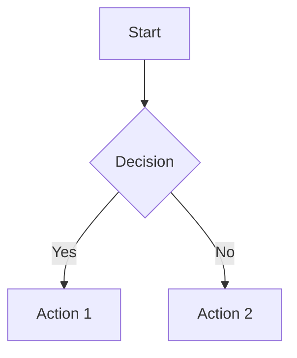

# SciMD Format Specification v0.1.0

> **Status**: Draft  
> **Date**: 2026-03-17  
> **Authors**: Juan Francisco Avilés Calderón  
> **License**: MIT

---

## 1. Overview

SciMD (Scientific Markdown) is a plain-text document format with the extension `.smd`. It extends Markdown with structured conventions for scientific and technical writing, optimized for:

- Human readability and authoring
- AI/LLM comprehension and training
- RAG (Retrieval-Augmented Generation) chunking and retrieval
- Elimination of OCR-dependent processing pipelines

A valid SciMD file is UTF-8 encoded plain text that consists of:

1. A **document header** (YAML frontmatter)
2. One or more **semantic sections**
3. Optional **rich elements** (charts, figures, diagrams, equations, references)

## 2. Document Header

Every SciMD document MUST begin with a YAML frontmatter block delimited by `---smd` (opening) and `---` (closing):

```yaml
---smd
title: "Document Title"
authors:
  - name: "Author Name"
    orcid: "0000-0000-0000-0000"       # Optional
    affiliation: "Institution"           # Optional
    email: "author@example.com"          # Optional
    corresponding: true                  # Optional, default false
version: "0.1.0"                         # SciMD spec version
lang: "en"                               # BCP 47 language tag
date: "2026-03-17"                       # ISO 8601
license: "CC-BY-4.0"                     # SPDX identifier, optional
keywords: ["keyword1", "keyword2"]       # Optional
abstract: |                              # Optional, recommended
  A brief summary of the document content.
citation:                                # Optional
  doi: "10.1234/example"
  bibtex: |
    @article{...}
---
```

### 2.1 Required Fields

| Field | Type | Description |
|---|---|---|
| `title` | string | Document title |
| `authors` | array | At least one author with `name` |
| `version` | string | SciMD spec version (semver) |
| `lang` | string | Primary language (BCP 47) |

### 2.2 Optional Fields

| Field | Type | Description |
|---|---|---|
| `date` | string | Publication/creation date (ISO 8601) |
| `license` | string | SPDX license identifier |
| `keywords` | array | Topic keywords for indexing |
| `abstract` | string | Document summary |
| `citation` | object | Citation metadata (DOI, BibTeX) |
| `references` | array | Bibliography entries (see §8) |
| `custom` | object | User-defined metadata |

## 3. Semantic Sections

### 3.1 Section Syntax

Content MUST be organized into semantic sections:

```markdown
::section{#unique-id}
::meta
type: introduction | methods | results | discussion | conclusion | appendix | custom
summary: "One-line description of this section's content"
depends_on: ["#other-section-id"]   # Optional
lang: "en"                          # Optional, overrides document lang
::

# Section Title

Content goes here...

::endsection
```

### 3.2 Section Rules

1. Every section MUST have a unique `id` (valid CSS identifier syntax)
2. Every section MUST have a `type` from the allowed list or `custom`
3. Every section MUST have a `summary` — a single sentence describing the content
4. Sections MUST NOT be nested (flat structure)
5. The `depends_on` field declares logical dependencies between sections
6. Section order in the file defines reading order

### 3.3 Section Types

| Type | Purpose |
|---|---|
| `introduction` | Background, motivation, problem statement |
| `methods` | Methodology, experimental setup, algorithms |
| `results` | Data, measurements, outputs |
| `discussion` | Analysis, interpretation, comparison |
| `conclusion` | Summary, implications, future work |
| `appendix` | Supplementary material |
| `literature-review` | Survey of related work |
| `custom` | Any other section (describe in summary) |

### 3.4 Why Flat Sections?

Nested structures create ambiguity for RAG chunking. Flat sections with explicit `depends_on` relationships provide:

- Deterministic chunk boundaries
- Clear dependency graphs
- Consistent retrieval granularity
- Simple sequential processing

## 4. Inline Content

### 4.1 Standard Markdown

SciMD supports all CommonMark syntax:

- Headings (`#`, `##`, `###`, etc.)
- Bold (`**text**`), italic (`*text*`), code (`` `code` ``)
- Links (`[text](url)`), blockquotes (`> text`)
- Ordered and unordered lists
- Horizontal rules (`---`)
- Code blocks (fenced with ` ``` `)

### 4.2 LaTeX Mathematics

**Inline math**: Wrap in single dollar signs:

```
The energy is $E = mc^2$ where $m$ is mass.
```

**Block math**: Wrap in double dollar signs with optional label:

```
::equation{#eq-arrhenius}
$$
k = A \exp\left(-\frac{E_a}{RT}\right)
$$
::label Arrhenius equation for reaction rate constant
::endequation
```

Rules:

- Inline math MUST NOT contain newlines
- Block math SHOULD use the `::equation` wrapper for labeling and referencing
- LaTeX packages are limited to: amsmath, amssymb, amsfonts, mathtools

### 4.3 Cross-References

Reference any labeled element using `@ref{#id}`:

```
As shown in @ref{#fig-conversion}, the trend is linear.
See @ref{#eq-arrhenius} for the rate equation.
This was discussed in @ref{#intro}.
```

## 5. Charts and Data Visualizations

Charts are the core innovation of SciMD. Instead of images, authors provide **structured data** and **interpretations**.

### 5.1 Chart Syntax

```markdown
::chart{#unique-id}
::title Optional chart title
::interpretation
Author's interpretation of what the data shows. This text is
MANDATORY and should describe the key findings, trends, and
significance visible in the data. Multiple paragraphs allowed.
::
::source Optional: "Journal of Example, 2025, Table 3"
| Column A | Column B | Column C |
|---|---|---|
| value1 | value2 | value3 |
| value4 | value5 | value6 |
::endchart
```

### 5.2 Chart Rules

1. Every chart MUST have a unique `id`
2. Every chart MUST have an `::interpretation` block
3. Data SHOULD be provided as a Markdown table (pipe-delimited)
4. If tabular data is unavailable, the author MUST provide a thorough description in the interpretation block, including all data points, values, and trends
5. Column headers SHOULD include units in parentheses: `Temperature (°C)`
6. Numeric values SHOULD use consistent decimal precision
7. The `::source` field credits data origin

### 5.3 Extended Data Formats

For datasets too large for inline tables, use a reference to an accompanying CSV:

```markdown
::chart{#large-dataset}
::interpretation
The spectral analysis reveals three dominant peaks at 450nm,
520nm, and 680nm, consistent with chlorophyll absorption bands.
::
::data-file spectra.csv
::columns wavelength_nm, absorbance, sample_id
::endchart
```

## 6. Figures and Images

### 6.1 Figure Syntax

```markdown
::figure{#unique-id}
::file image.png
::description
Detailed description of what the image shows. This should be
comprehensive enough that a reader (or AI) who cannot see the
image understands its content completely. Describe spatial
relationships, colors, labels, and any visual elements.
::
::interpretation
Author's analysis of the figure's significance. What should
the reader take away from this image? How does it relate to
the text?
::
::source Optional: "Adapted from Smith et al., 2024"
::endfigure
```

### 6.2 Figure Rules

1. Every figure MUST have a unique `id`
2. Every figure MUST have a `::description` block (objective visual description)
3. Every figure MUST have an `::interpretation` block (author's analysis)
4. The `::file` field references an image path relative to the `.smd` file
5. Supported formats: PNG, JPEG, SVG, WebP
6. If the image is unavailable, the description and interpretation MUST be sufficient to understand the content without it

### 6.3 Why Two Text Blocks?

- **Description** = "What is shown" (objective, factual)
- **Interpretation** = "What it means" (analytical, contextual)

This separation allows AI systems to distinguish between raw visual content and author-assigned meaning, reducing hallucination risk.

## 7. Diagrams

### 7.1 Diagram Syntax

```markdown
::diagram{#unique-id}
::type flowchart | sequence | class | state | er | gantt | pie | mindmap | custom
::description
Plain-language description of the diagram for AI processing.
What entities exist? What are the relationships? What flow
or structure does this represent?
::


::enddiagram

```

### 7.2 Diagram Rules

1. Every diagram MUST have a unique `id`
2. Every diagram MUST have a `::description` block
3. Diagram code MUST be valid MermaidJS syntax
4. The `::type` field categorizes the diagram for processing

## 8. References and Citations

### 8.1 Bibliography in Header

```yaml
---smd
# ... other fields ...
references:
  - id: "smith2024"
    type: "article"
    authors: ["Smith, J.", "Doe, A."]
    title: "Example Paper Title"
    journal: "Journal of Examples"
    year: 2024
    doi: "10.1234/example"
  - id: "jones2023"
    type: "book"
    authors: ["Jones, B."]
    title: "Example Book"
    publisher: "Academic Press"
    year: 2023
    isbn: "978-0-000-00000-0"
---
```

### 8.2 Inline Citations

```markdown
Previous work @cite{smith2024} demonstrated that...
Multiple sources confirm this @cite{smith2024, jones2023}.
```

## 9. Callouts and Annotations

### 9.1 Callout Blocks

```markdown
::callout{type="warning"}
This method assumes ambient pressure. Results may vary
under high-pressure conditions.
::endcallout
```

Allowed types: `note`, `warning`, `important`, `tip`, `example`, `definition`

### 9.2 Author Annotations

```markdown
::annotation
This paragraph was revised on 2026-03-15 to correct the
reported catalyst loading from 5% to 3% w/w.
::endannotation
```

## 10. Processing Guidelines

### 10.1 For RAG Systems

1. **Chunking**: Each `::section` is a natural chunk boundary
2. **Metadata**: Use section `summary` and `type` for retrieval ranking
3. **Dependencies**: Use `depends_on` to include related context
4. **Charts**: Index both interpretation text and tabular data
5. **Figures**: Index description + interpretation as text content

### 10.2 For LLM Training

1. **Structure preservation**: Maintain section boundaries in training data
2. **Interpretation grounding**: Chart/figure interpretations serve as ground truth
3. **Formula preservation**: Keep LaTeX source, never convert to images
4. **Sequential coherence**: Document order is intentional — preserve it

### 10.3 For Document Conversion

1. **To HTML**: MermaidJS renders natively; LaTeX via KaTeX/MathJax
2. **To PDF**: Pandoc pipeline with LaTeX backend
3. **To DOCX**: Pandoc with custom reference template
4. **From PDF**: Not applicable — SciMD eliminates the need for PDF→text

## 11. File Conventions

- Extension: `.smd`
- Encoding: UTF-8 (no BOM)
- Line endings: LF (Unix-style)
- Max line length: Recommended 80 characters for prose, no limit for tables
- Accompanying files: Same directory or `./assets/` subdirectory

## 12. MIME Type

Proposed: `text/scimd` (pending IANA registration)

Fallback: `text/markdown` with `variant=scimd` parameter

## 13. Versioning

The specification follows Semantic Versioning:

- **MAJOR**: Breaking changes to syntax or required fields
- **MINOR**: New optional features, backward-compatible
- **PATCH**: Clarifications, typo fixes

Documents declare their target spec version in the `version` header field.

---

## Appendix A: Complete Syntax Reference

| Element | Opening | Closing | Required Fields |
|---|---|---|---|
| Document header | `---smd` | `---` | title, authors, version, lang |
| Section | `::section{#id}` | `::endsection` | type, summary |
| Chart | `::chart{#id}` | `::endchart` | interpretation, data or description |
| Figure | `::figure{#id}` | `::endfigure` | file, description, interpretation |
| Diagram | `::diagram{#id}` | `::enddiagram` | type, description, mermaid code |
| Equation | `::equation{#id}` | `::endequation` | LaTeX math, label |
| Callout | `::callout{type="..."}` | `::endcallout` | type |
| Annotation | `::annotation` | `::endannotation` | — |
| Meta block | `::meta` | `::` | (within section) |
| Interpretation | `::interpretation` | `::` | (within chart/figure) |
| Description | `::description` | `::` | (within figure/diagram) |

## Appendix B: Design Decisions

### Why not extend an existing format?

Existing formats (Markdown, reStructuredText, AsciiDoc) were designed for *rendering* documents. SciMD is designed for *understanding* documents. The additions (mandatory interpretations, structured data, semantic sections) are not rendering directives — they are comprehension metadata.

### Why flat sections instead of nested?

See §3.4. Nesting creates ambiguity in chunk granularity and complicates dependency tracking.

### Why mandate author interpretations?

The single largest source of AI hallucination in scientific documents is the model "interpreting" a figure or chart it cannot see or has parsed incorrectly. By making the author's interpretation a first-class, mandatory element, we provide ground truth that eliminates this failure mode.

### Why Markdown as a base?

Markdown has the largest ecosystem of tooling, the lowest barrier to entry, and the broadest developer/researcher familiarity. It is also inherently plain text, which aligns with our OCR-elimination goal.
