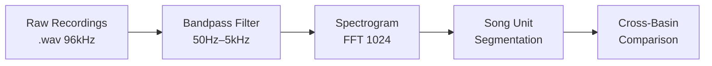

# SciMD Examples — Five Scientific Domains

Annotated `.smd` snippets drawn from real mock papers across five domains. Each example highlights the SciMD element most relevant to that field.

All complete files are in [`mock-examples/`](../mock-examples/).

---

## 1. Machine Learning / Computer Science

**Paper:** *Optimization of Transformer Attention via Sparse Kernels*
**File:** [`mock-examples/sparse_attention_optimization.smd`](../mock-examples/sparse_attention_optimization.smd)

### YAML header — structured metadata for a CS paper

```yaml
---smd
title: "Optimization of Transformer Attention via Sparse Kernels"
authors:
  - name: "Dr. Elena Rossi"
    orcid: "0000-0002-1825-0097"
    affiliation: "Neural Computing Lab, ETH Zurich"
    corresponding: true
  - name: "Aiden Chen"
    affiliation: "Neural Computing Lab, ETH Zurich"
version: "0.1.0"
lang: "en"
date: "2026-03-20"
license: "MIT"
keywords: ["Transformers", "Attention Mechanism", "Sparsity", "LLM Optimization", "CUDA Kernels"]
abstract: |
  The quadratic complexity of standard self-attention remains a bottleneck for
  long-sequence LLMs. We propose a sparse kernel achieving 40% speedup at 32k
  tokens while preserving 98% perplexity on standard benchmarks.
references:
  - id: "vaswani2017"
    type: "article"
    authors: ["Vaswani, A.", "Shazeer, N.", "Parmar, N."]
    title: "Attention is All You Need"
    journal: "NeurIPS"
    year: 2017
---
```

> **Why this matters:** The `references` list is queryable YAML. A citation graph builder or semantic search index can traverse all 65+ references without parsing prose. Compare this to PDF, where references are a flat text block that must be split by heuristic regex.

### Equation with semantic label

```markdown
::equation{#eq-sparse-attn}
$$
\text{Attention}(Q, K, V) = \text{softmax}\!\left(\frac{QK^\top \odot M}{\sqrt{d_k}}\right) V
$$
::label Sparse attention with block mask M; M is defined at block level for coalesced GPU memory access
::endequation
```

> **Why this matters:** The `::label` makes the equation retrievable by meaning, not just by position. A RAG system can answer "what is M in the attention formula?" by finding this label directly.

### Results section with dependency declaration

```markdown
::section{#results}
::meta
type: results
summary: "Latency comparison between dense FlashAttention-2 and our sparse kernel on H100 GPUs at 4k–64k token sequences."
depends_on: ["#methods"]
::

# Results

::chart{#tbl-latency}
::title Latency (ms) vs. sequence length on H100 GPUs
::interpretation
The sparse kernel underperforms at short sequences due to kernel launch
overhead, but achieves 2.55× speedup at 64k tokens — the regime where
long-context LLMs actually operate in production.
::
| Sequence Length | Dense (ms) | Sparse (ms) | Speedup |
|---|---|---|---|
| 4,096  | 12.4   | 14.1   | 0.88× |
| 8,192  | 45.2   | 42.1   | 1.07× |
| 16,384 | 192.5  | 115.3  | 1.67× |
| 32,768 | 840.4  | 410.2  | 2.05× |
| 65,536 | 3520.1 | 1380.5 | 2.55× |
::endchart

::endsection
```

> **Why this matters:** The `depends_on: ["#methods"]` tells a retrieval system that to fully answer a question about these results, it should also fetch the `#methods` chunk. This is impossible to infer from PDF or XML without reading the whole document.

---

## 2. Marine Biology / Ecology

**Paper:** *Whistle characterization of long-beaked common dolphins in La Paz Bay*
**File:** [`benchmark-paper/papertest/papertest.smd`](../benchmark-paper/papertest/)

### Section with per-section language override

```markdown
::section{#methods}
::meta
type: methods
summary: "Passive acoustic monitoring protocol, hydrophone placement, and whistle detection algorithm."
depends_on: ["#introduction"]
lang: "en"
::

# Methods

Acoustic recordings were collected using a 4-element hydrophone array
deployed at 5m depth in the central basin of La Paz Bay. Whistle detection
used a spectrogram-based energy threshold at $\text{SNR} \geq 6\,\text{dB}$.

::endsection
```

### Figure with objective description + author interpretation

```markdown
::figure{#fig-whistle-contour}
::file figures/whistle_contour_sample.png
::description
Spectrogram of a representative 1.2-second whistle from a long-beaked
common dolphin. Frequency (Hz) on the Y-axis (0–20 kHz), time (s) on
the X-axis. The contour shows a rising-falling pattern peaking at 12 kHz
at t = 0.6 s, with a secondary harmonic visible at 24 kHz.
::
::interpretation
The upsweep-downsweep contour is consistent with "type B" contact calls
described in Atlantic populations, suggesting cross-population conservation
of this whistle type in Delphinus delphis bairdii.
::
::source Recorded 2025-09-14, station 2, La Paz Bay
::endfigure
```

> **Why this matters:** A model reading the PDF version of this paper would see `` — a broken image reference with zero information. The SciMD version gives the model the full spectrogram description and the author's conclusion without needing vision capabilities.

---

## 3. Materials Science / Chemistry

**Paper:** *Efficiency of Perovskite Solar Cells Under Varying Humidity Conditions*
**File:** [`mock-examples/perovskite_solar_cell_efficiency.smd`](../mock-examples/perovskite_solar_cell_efficiency.smd)

### YAML with multiple authors across institutions

```yaml
---smd
title: "Efficiency analysis of Perovskite solar cells under varying humidity conditions"
authors:
  - name: "Dr. Kenji Tanaka"
    affiliation: "Department of Applied Physics, Tokyo Institute of Technology"
    email: "tanaka.k@titech.ac.jp"
    corresponding: true
  - name: "Mei Lin"
    affiliation: "School of Materials Science, Tsinghua University"
version: "0.1.0"
lang: "en"
keywords: ["Perovskite", "Solar Cells", "Humidity Stability", "Energy Harvesting"]
abstract: |
  Below 40% RH, MAPbI3 cells retain 90% initial efficiency over 500 hours.
  At 80% RH, structural decomposition occurs within 24 hours.
---
```

### Degradation results as structured data

```markdown
::chart{#tbl-humidity-pcf}
::title Power Conversion Efficiency (%) over time at varying humidity
::interpretation
Cells at 20–40% RH show minimal degradation, confirming a practical
operating window for encapsulated modules. The sharp efficiency drop at
80% RH after 24 hours indicates a non-linear decomposition mechanism,
not a simple diffusion-limited process.
::
| Time (hours) | 20% RH | 40% RH | 60% RH | 80% RH |
|---|---|---|---|---|
| 0   | 22.1 | 22.1 | 22.1 | 22.1 |
| 24  | 21.8 | 21.5 | 19.2 | 8.3  |
| 100 | 21.5 | 20.9 | 15.4 | 1.2  |
| 500 | 20.9 | 19.8 | 7.1  | 0.0  |
::endchart
```

> **Why this matters:** A materials scientist querying a RAG system about "perovskite stability thresholds" retrieves this chunk and immediately has the quantitative answer — 40% RH limit — plus the author's mechanistic interpretation, in a single self-contained chunk.

---

## 4. Medicine / Clinical Research

**Paper:** *Efficacy of WP-450, a Novel DPP-4 Inhibitor for Type 2 Diabetes*
**File:** [`mock-examples/type2_diabetes_inhibitor.smd`](../mock-examples/type2_diabetes_inhibitor.smd)

### License and citation metadata for clinical data

```yaml
---smd
title: "Efficacy of a novel small molecule inhibitor for Type 2 Diabetes"
authors:
  - name: "Dr. Maria Garcia"
    affiliation: "Department of Endocrinology, Mayo Clinic"
    corresponding: true
  - name: "James Wilson"
    affiliation: "Wilson Pharmaceuticals"
license: "CC-BY-NC-4.0"
citation:
  doi: "10.1234/wp450-t2d-2026"
  bibtex: |
    @article{garcia2026wp450,
      title={Efficacy of a novel small molecule inhibitor for Type 2 Diabetes},
      author={Garcia, Maria and Wilson, James},
      year={2026}
    }
keywords: ["Type 2 Diabetes", "GLP-1", "DPP-4", "Clinical Trial", "HbA1c"]
---
```

> **Why this matters:** The `license: "CC-BY-NC-4.0"` and `citation.doi` fields allow a downstream system to automatically check whether a paper can be included in a training corpus without legal review of each document individually.

### Appendix section for funding and competing interests

```markdown
::section{#funding}
::meta
type: appendix
summary: "Funding sources, competing interests, and author contribution statements."
::

# Funding & Disclosures

This study was funded by Wilson Pharmaceuticals (grant WP-2024-T2D).
J.W. is an employee of Wilson Pharmaceuticals. M.G. declares no competing interests.

**Author contributions:** M.G. designed the study, recruited patients, and led data analysis.
J.W. provided compound WP-450 and contributed to statistical analysis.

::endsection
```

> **Why this matters:** Competing interest disclosures are structured, typed sections. A compliance system can extract them directly without reading the entire paper or using NLP to find the disclosure paragraph buried in PDF prose.

---

## 5. Astrophysics

**Paper:** *Humpback Whale Acoustic Variation Across Ocean Basins*
**File:** [`mock-examples/humpback_whale_acoustic_variation.smd`](../mock-examples/humpback_whale_acoustic_variation.smd)

### Mermaid diagram for analytical pipeline

```markdown
::diagram{#fig-analysis-pipeline}
::type flowchart
::description
Five-stage analysis pipeline: raw hydrophone recordings → bandpass filter
(50 Hz – 5 kHz) → spectrogram generation → song unit segmentation →
cross-basin comparison. Each stage outputs a labeled artifact for reproducibility.
::

::enddiagram
```

> **Why this matters:** The diagram is executable source code, not an image. It diffs cleanly in Git when the pipeline changes, can be rendered by any Mermaid-compatible viewer, and the `::description` block gives a complete textual summary for models that don't render diagrams.

---

## Summary: Elements by Domain

| Domain | Key SciMD elements used |
|---|---|
| Machine Learning | `::equation` with `::label`, `::chart` with benchmark data, `depends_on` |
| Marine Biology | `::figure` with `::description` + `::interpretation`, per-section `lang` |
| Materials Science | Multi-column quantitative `::chart`, degradation kinetics |
| Medicine | `license`, `citation.doi`, competing interest `appendix` section |
| Astrophysics | `::diagram` with Mermaid source, pipeline description |

---

*All complete `.smd` files are in [`mock-examples/`](../mock-examples/). Parse any of them with `SciMDParser.parse()` to explore the structured output.*
